# 🍳 PantryPioneer

PantryPioneer är mitt examensarbete, byggt med React + Vite med databashantering i Supabase. Appen hjälper användaren att söka efter recept, spara favoriter och hantera sitt skafferi.

> **Syftet är enkelt:** Att underlätta när det känns som att man inte har något att laga. Skriv in det du har hemma och låt PantryPioneer göra jobbet.

Den här README:n är skriven för att du enkelt ska kunna sätta upp och testa projektet på egen hand.

---

## Snabbaste sättet att testa (Live Demo)

Det enklaste sättet att genomföra tillgänglighetstester är att gå direkt till den publicerade webbplatsen:  
🔗 **[pantrypioneer-graduation-project.netlify.app](https://pantrypioneer-graduation-project.netlify.app)**

Du kan skapa ett konto direkt på webbplatsen. För att minska risken för oönskade registreringar krävs en **Access Code**. Den får du separat av mig (den publiceras inte här).

_Om du istället väljer att köra projektet lokalt kan du sätta en egen access code._

---

## Kör projektet lokalt

Att köra projektet lokalt kräver lite fler steg. Följ instruktionerna nedan:

### Förberedelse

- En klon av detta repository
- Node.js (jag har använd 22.16.0)
- npm
- En webbläsare

_(Du behöver inte en egen API-nyckel till TheMealDB, då appen använder en publik testnyckel.)_

### Starta appen (utan databas)

Om du bara vill kika på koden och UI:t kan du installera och köra direkt, men funktioner som inloggning och sparat skafferi kommer då inte att fungera.

```bash
npm install
npm run dev
```

Öppna sedan URL:en som visas i terminalen, oftast:

http://localhost:5173

### Supabase-setup

För att få lokal körning att fungera fullt ut behöver du också skapa en egen <ins>Supabase-databas</ins>.

Det behövs för inloggning, sparade favoriter, skafferifunktioner och borttagning av konto.

Du kan även skippa Supabase-setupen, men då får du inte tillgång till ovannämnda funktioner.

#### 1. Skapa ett Supabase-projekt

1. Gå till https://supabase.com/ och skapa ett konto om du inte redan har ett.
2. Skapa ett nytt projekt.
3. Välj ett lösenord för databasen och spara det på ett säkert ställe.

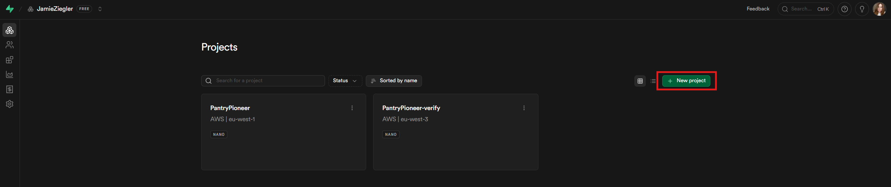

#### 2. Hämta rätt nycklar

När projektet är skapat behöver du två värden från Supabase:

- Project URL
- publishable key

Du hittar dem i Supabase under Project Settings > API.

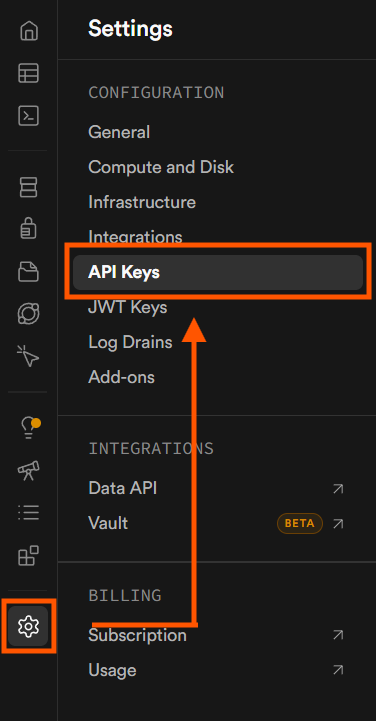

De här ska in i din `.env`-fil i projektets rot:

```env
VITE_SUPABASE_URL=DIN_SUPABASE_URL
VITE_SUPABASE_PUBLISHABLE_KEY=DIN_SUPABASE_ANON_KEY
VITE_SIGNUP_CODE=DIN_ACCESS_CODE
```

`VITE_SIGNUP_CODE` är den kod som krävs för att skapa konto i appen. Du kan återanvända den jag skickar separat, eller skapa en egen.

Om du ändrar något i din env-fil behöver du starta om dev-servern så att Vite läser in de nya värdena.

#### 3. Aktivera e-postinloggning

1. Öppna Supabase Dashboard.
2. Gå till Authentication > Sign In/Providers och scrolla ned till "Auth Providers".
3. Kontrollera att Email-provider är aktiverad.
4. På samma sida, högre upp, stäng av "Confirm email".

Det gör att du kan testa snabbare i demo-läge utan att behöva bekräfta via mail.

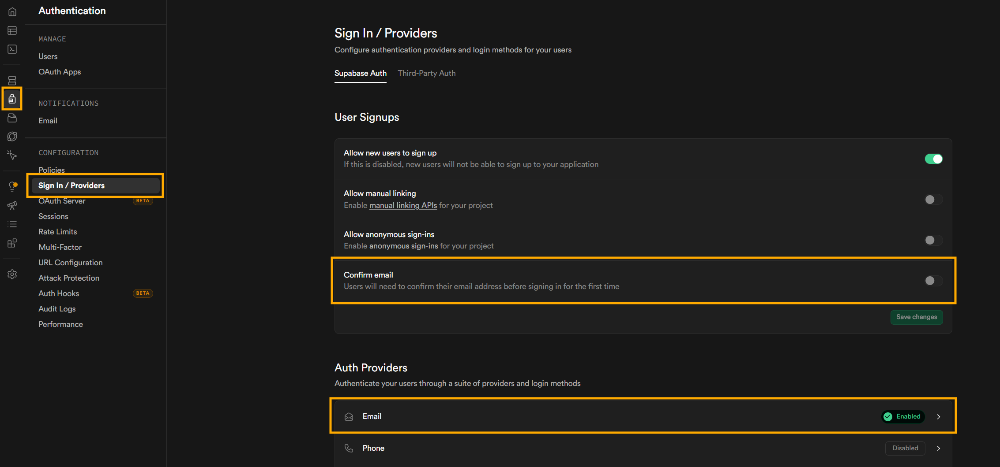

#### 4. Skapa tabellerna som appen använder

Allt detta kan skapas direkt via deras table editor, men enklast för att få likadant är att du bara kopierar detta in i SQL-editorn:
(Koden finns att kopiera efter bilden)

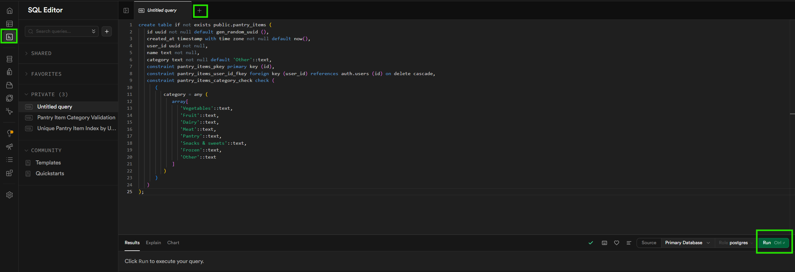

```sql
create table if not exists public.pantry_items (
   id uuid not null default gen_random_uuid (),
   created_at timestamp with time zone not null default now(),
   user_id uuid not null,
   name text not null,
   category text not null default 'Other'::text,
   constraint pantry_items_pkey primary key (id),
   constraint pantry_items_user_id_fkey foreign key (user_id) references auth.users (id) on delete cascade,
   constraint pantry_items_category_check check (
      (
         category = any (
            array[
               'Vegetables'::text,
               'Fruit'::text,
               'Dairy'::text,
               'Meat'::text,
               'Pantry'::text,
               'Snacks & sweets'::text,
               'Frozen'::text,
               'Other'::text
            ]
         )
      )
   )
);

create unique index if not exists pantry_items_user_name_unique on public.pantry_items using btree (user_id, lower(name));

create table if not exists public.favorites (
   id bigint generated by default as identity not null,
   created_at timestamp with time zone null default now(),
   user_id uuid null,
   recipe_id text null,
   constraint favorites_pkey primary key (id),
   constraint favorites_user_id_fkey foreign key (user_id) references auth.users (id)
);

create table if not exists public.account_deletion_requests (
   id bigint generated by default as identity not null,
   created_at timestamp with time zone not null default now(),
   user_id uuid null default gen_random_uuid (),
   email text null default ''::text,
   status text null default 'pending'::text,
   constraint account_deletion_requests_pkey primary key (id)
);
```

#### 5. Verifiera tabeller och slå på Row Level Security

Verifiera att dessa tabeller finns via Table Editorn:

- `pantry_items`
- `favorites`
- `account_deletion_requests`

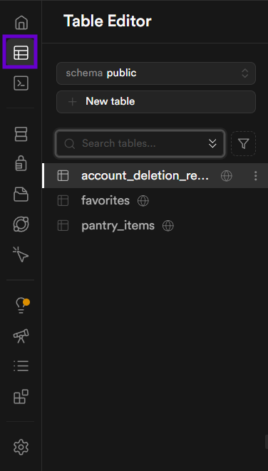

Efter att tabellerna finns ska du slå på RLS för alla tre tabeller, du kan göra det i dashboarden eller med SQL:

```sql
alter table public.pantry_items enable row level security;
alter table public.favorites enable row level security;
alter table public.account_deletion_requests enable row level security;
```

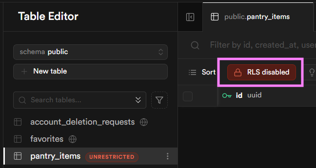

#### 6. Lägg till policies

Appen behöver policies som låter varje användare läsa och skriva sin egen data.

Kör detta i SQL Editor:

```sql
create policy "Users can read own pantry items"
on public.pantry_items
for select
using (auth.uid() = user_id);

create policy "Users can insert own pantry items"
on public.pantry_items
for insert
with check (auth.uid() = user_id);

create policy "Users can delete own pantry items"
on public.pantry_items
for delete
using (auth.uid() = user_id);

create policy "Users can read own favorites"
on public.favorites
for select
using (auth.uid() = user_id);

create policy "Users can insert own favorites"
on public.favorites
for insert
with check (auth.uid() = user_id);

create policy "Users can delete own favorites"
on public.favorites
for delete
using (auth.uid() = user_id);

create policy "Users can read own deletion requests"
on public.account_deletion_requests
for select
using (auth.uid() = user_id);

create policy "Users can insert own deletion requests"
on public.account_deletion_requests
for insert
with check (auth.uid() = user_id);
```

Policyerna kan du sen se under policy fliken:

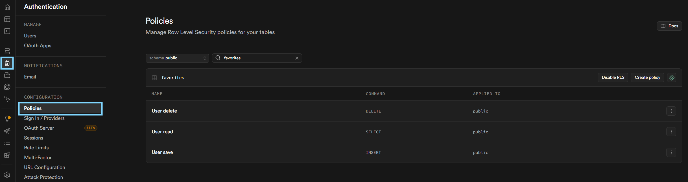

#### 7. Fyll i miljövariablerna och testa

1. Gå till starten av ditt Supabase-projekt och tryck på "framework".
2. Välj React och Vite.
3. Installera paketet som instruerats, om det inte redan är installerat.
4. Kopiera env-variablerna som projektet ger dig.
5. Spara dem i `.env` i projektets rot.
6. Var uppmärksam på variablernas namn så att de stämmer överens med de som använts i koden.

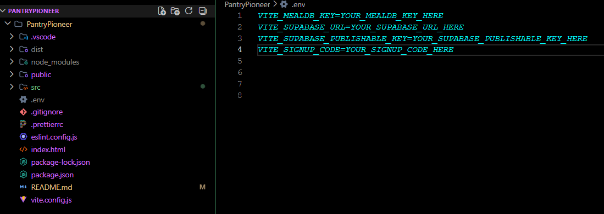

7. Kör `npm run dev`.
8. Testa att registrera ett konto, logga in, lägga till pantry-items och spara favoriter.

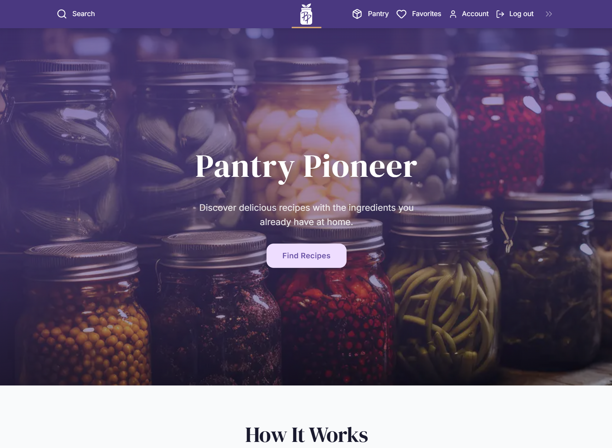

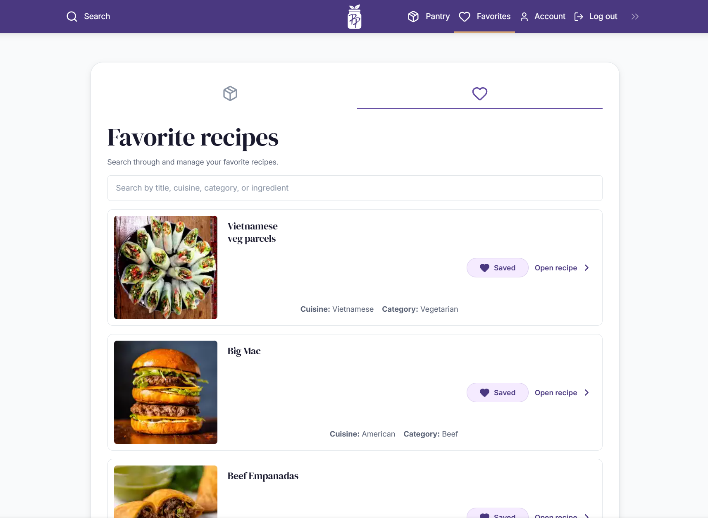

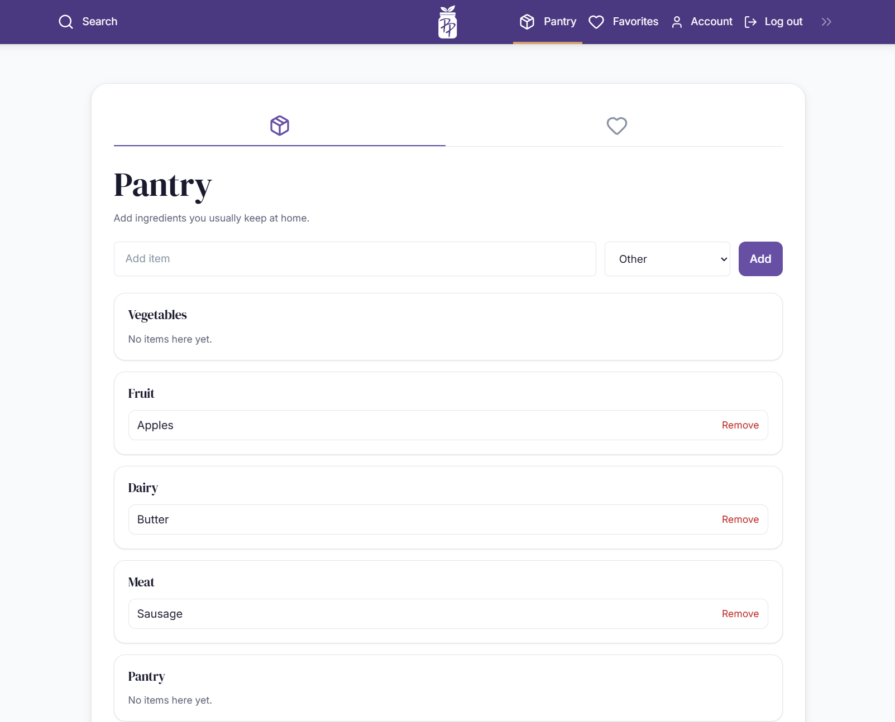
Om allt fungerar ska appen kunna läsa och skriva till Supabase utan fel.

---

## För att köra projektet snabbt

```bash
npm run dev
```

Öppna sedan URL:en som visas i terminalen, oftast:

http://localhost:5173

## För ett rättvist prestandatest

Kör i incognito-läge och använd en produktionsbyggd version av appen.

```bash
npm run build
npm run preview
```

Öppna sedan URL:en som visas i terminalen, oftast:

http://localhost:4173
